# 个人信息

> 🏛️ **香港科技大学电子与计算机工程专业 (CPEG), 2023-2027**
> 
> 🤖 **3 年 RoboMaster 参赛经历 (香港科技大学 ENTERPRIZE 战队):**
> 
> * 于 2025 赛季担任**机械组组长**职位
> * 获得 2025 赛季 **工程全明星**称号
> * 创造 4 级矿石 **5.8s** 最短兑换时长纪录
> 
> ⚙️ **熟练掌握机械设计与制造流程:**
> 
> * 熟练使用 **SOLIDWORKS** 进行复杂机构综合设计与结构优化
> * 对**AutoCAD、Fusion 360**有一定使用经验
> * 具备丰富的 **3D 打印、CNC 加工、气动系统**使用经验
> * 拥有两年的高精度装配经验
> 
> 💻 **嵌入式与软件开发:**‘
> 
> * 使用 **Python、MATLAB** 进行项目脚本编写与数据处理
> * 懂得 **STM32、C/C++** 嵌入式开发的基本流程

---

# 个人项目

### 1.1 RoboMaster2025 工程机器人

| 项目图片 | 项目详情 |
| :--- | :--- |
|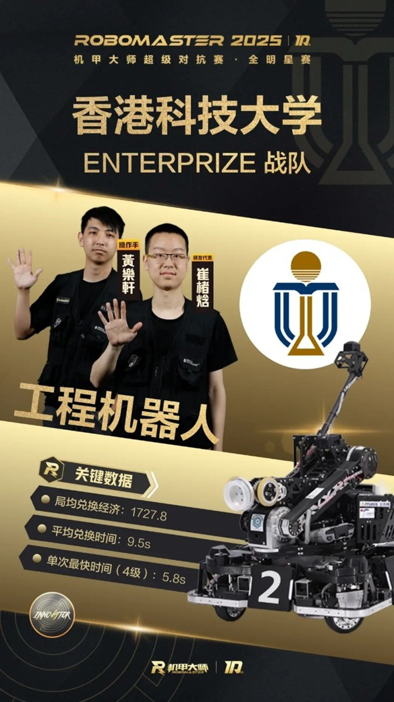 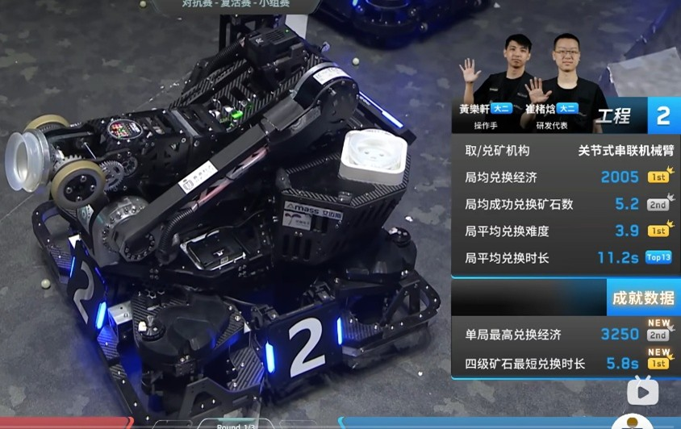 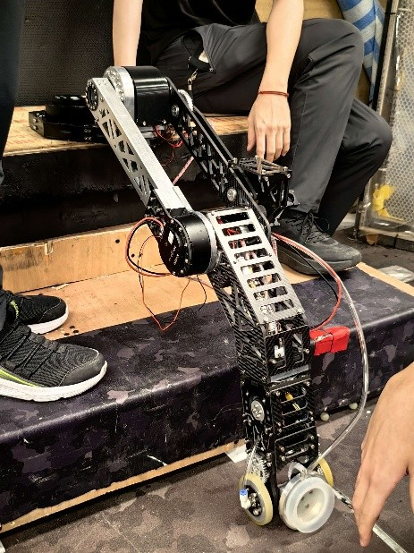 | **核心突破：** 实现 5.8s 的破纪录采矿速度，入选 2025 赛季全明星阵容。  **机械设计：** **高性能六轴机械臂系统** • **负载与范围**：针对重载工况设计，末端有效负载逾 **30kg**，具备同级别领先的作业半径与空间通达度。 • **鲁棒性与维护**：结构经优化具备极高强度，在半年的高强度调试与实战中**零重大结构损伤**；采用模块化设计，支持快速迭代与小幅机构调整。 • **精度表现**：通过高刚性臂体设计与精密的传动补偿，确保重复定位精度满足精细作业需求。  **全向驱动底盘** • **动力方案**：使用**电动车橡胶轮**，兼顾极高的地面抓地力与减震性能。 • **结构特性**：自研简化版气缸悬挂舵轮结构，在保证全向移动灵活性的同时，极大提升了机械臂底座稳定性。  **气动系统** • **闭环控制**：自主改装高流量气泵，实现流量精准可调。 • **状态反馈**：通过电机电流/位置反馈逻辑，实现对吸附状态的**实时监测**，提升作业成功率。  **综合机构应用与工业设计** • **传动多元化**：综合运用齿轮、连杆、链条及同步带等多种传动形式，实现动力的高效匹配。 • **优雅走线**：遵循工业级标准进行管线管理，确保多自由度运动下的走线安全与视觉美感。`机械设计` `系统集成` `高精度` `高稳定性`  |

**项目链接：** [🔗 演示视频 (Bilibili)](https://www.bilibili.com/video/BV1Y482zjERP/?spm_id_from=333.788.videopod.sections&vd_source=a3191892d8abed85f77e649dae496839) | [🔗 机械开源链接](https://bbs.robomaster.com/article/803685?source=8)

### 1.2 自定义控制器（高精度遥操作）

| 项目图片 | 项目详情 |
| :--- | :--- |
|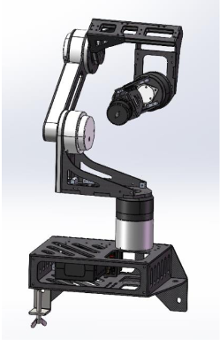| **核心功能**：作为核心输入终端，与工程机器人深度耦合，支撑起创纪录的作业效率。  **人机交互与人体工学设计** • **直觉化操控**：采用与主机械臂高度同构的六轴联动结构，实现操作者与机器人动作的 1:2 直觉映射。 • **人体工学优化**：针对手部抓握习惯进行轻量化设计，确保长时操作的舒适性与精准度。  **高性价比结构方案** • **低成本创新**：大量使用3d打印及简单的3轴CNC加工显著降低成本。 • **轻量化表现**：桌面级尺寸，臂体轻便且具备低运动惯量，提供丝滑操控反馈。 `机械设计` `低成本` `人机交互`  |

---

### 2. RoboMaster2024 英雄机器人

| 项目图片 | 项目详情 |
| :--- | :--- |
|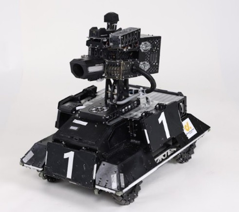| **高一致性双极摩擦轮发射系统** • **精度控制**：研发双极对冲摩擦轮机构，实现类高尔夫球弹丸在 10m 距离下的散布半径小于 **25×25cm**。通过优化摩擦轮，将弹丸初速度波动控制在 **±0.1m/s** 以内。  **高可靠性连续供弹机构** • **稳定输出**：设计并实现了一套具备防卡死逻辑的拨弹结构，支持 **2Hz** 的恒定频率稳定供弹，确保在激烈对战中无堵塞、零延迟。 • **自适应调整**：机构针对弹丸尺寸公差进行了容错处理，显著降低了异形弹丸导致的机构卡死率。  **自适应麦克纳姆轮悬挂底盘** • **全向移动**：基于麦克纳姆轮技术，实现机器人全维度灵巧位移与快速转场。 • **高冲击耐受**：自研**自适应悬挂系统**，具备极强的地形适应能力，能够平稳通过复杂路障，并成功通过 **30cm 垂直跌落**的高强度冲击测试。 `机械设计` `高精度` |

---

### 3. 四轴手臂外骨骼 (课设)

| 项目图片 | 项目详情 |
| :--- | :--- |
| 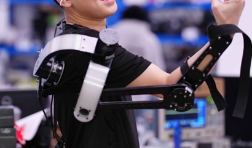 | 一款面向人机协同作业场景的**穿戴式动力辅助设备**。通过对人体上肢运动学模型的深度分析，设计并实现了一套具备 4 自由度的轻量化外骨骼原型机，旨在探索力矩补偿算法在提升人体搬运效率与降低劳动损伤方面的应用。  **运动学建模**：基于 DH 参数法建立外骨骼运动学模型，并在仿真环境下验证了工作空间的覆盖率。 **算法控制**：跟随模式：通过读取手背上的imu，预测手臂移动方向并进行跟随。助力模式：闭环控制电机保持现有动作，提供辅助力.`机械设计` `嵌入式开发` |

# 重要研发方案

### 1. 六轴机械臂结构

| 项目图片 | 项目详情 |
| :--- | :--- |
|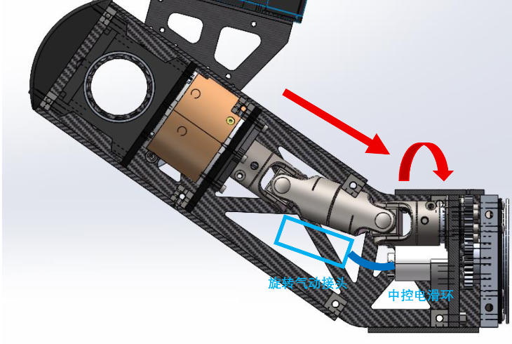 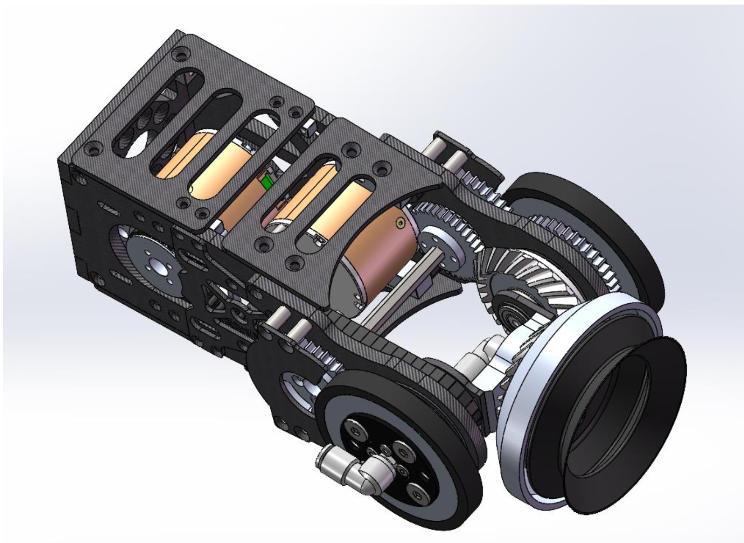| **工程机器人末端执行器核心设计** • **创新型“轮手”一体化末端**：自主研发集主动轮与气动吸盘于一体的末端执行器，抓取与移动功能切换。  • **多场耦合传输设计**：创新采用电滑环与中空旋转气动接头嵌套方案，完美解决 J4 关节无限旋转时的电、气信号绕线问题。  • **空间极简化布局**：利用万向轴传动将电机后置于 L4 结构内，在不牺牲美观的前提下大幅压缩末端体积以适配矿槽尺寸。  • **高精度传动集成**：J5 与 J6 关节综合运用等速同步轮、齿轮组及锥齿轮传动链，经实测 J5 达到近乎零背隙的传动精度。 | 

### 2. 改装气泵

| 项目图片 | 项目详情 |
| :--- | :--- |
|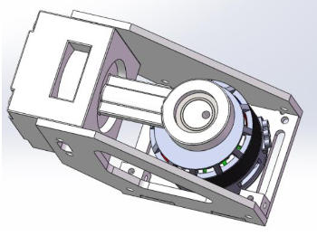| **高性能气泵二次开发**：通过将低端气泵电机改装为 3508 直流无刷电机驱动，在维持 $-85\text{kPa}$ 高真空度的前提下，实现了超过 $40\text{L/min}$ 的大流量输出，显著提升了末端吸盘的响应速度。利用电机电流反馈实时感知吸盘吸附状态，以极低成本实现了类气压计的检测功能。 | 

### 3. 多种舵轮

| 项目图片 | 项目详情 |
| :--- | :--- |
|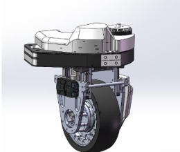 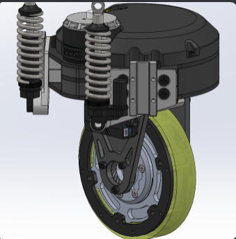| 项目主要为应对不同需求设计的不同舵轮模组。  **高负载，高平稳度，高机动性需求**：使用宽大的橡胶胎提供高抓地力，同时有一定减震能力。四个MGN7滑块与气弹簧组成舵下悬挂可以承受高负载，提供稳定性。   **小型化、轻量化**：舵上使用3508电机本体，齿轮传动配合光电门实现位置校准，尽量压缩结构高度。轮胎使用轻型聚氨酯轮。舵上悬挂进一步减少体积。| 

### 4. 两种不同结构供弹系统

| 项目图片 | 项目详情 |
| :--- | :--- |
|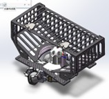 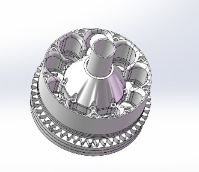|**大弹丸侧供弹**：用于2024英雄机器人上，经过多轮结构优化设计，对类似高尔夫球的弹丸可以实现稳定的2Hz供弹不卡顿。   **小弹丸中心供弹**：用于对内步兵、烧饼、无人机上。结构小巧轻便的同时可以提供17mm弹丸25Hz以上的供弹效率。 | 